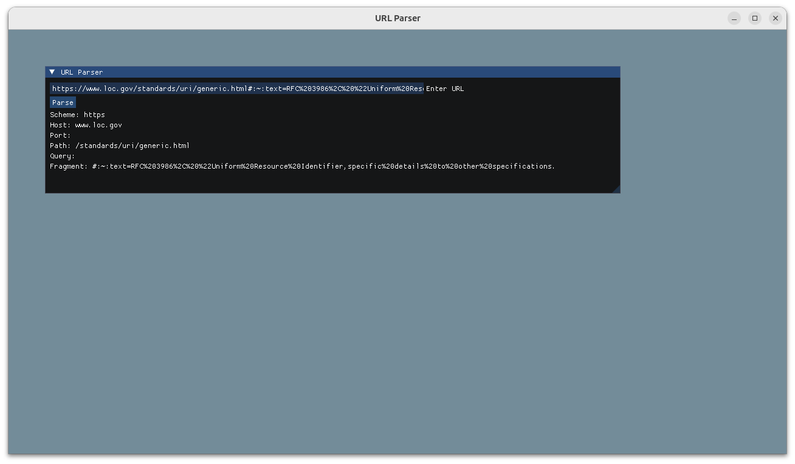

# urlpars4

A URL Parser with a simple UI using Dear ImGUI to practice regex

Executable link: https://github.com/empty-codes/urlpars4/releases/tag/v1.0.0
ImGUI source code: https://github.com/ocornut/imgui/blob/master/docs/README.md

No copyright infringement intended
